CUDA Path Tracer
================

**University of Pennsylvania, CIS 565: GPU Programming and Architecture, Project 3**

* (TODO) YOUR NAME HERE
* Tested on: (TODO) Windows 22, i7-2222 @ 2.22GHz 22GB, GTX 222 222MB (Moore 2222 Lab)

### (TODO: Your README)

*DO NOT* leave the README to the last minute! It is a crucial part of the
project, and we will not be able to grade you without a good README.


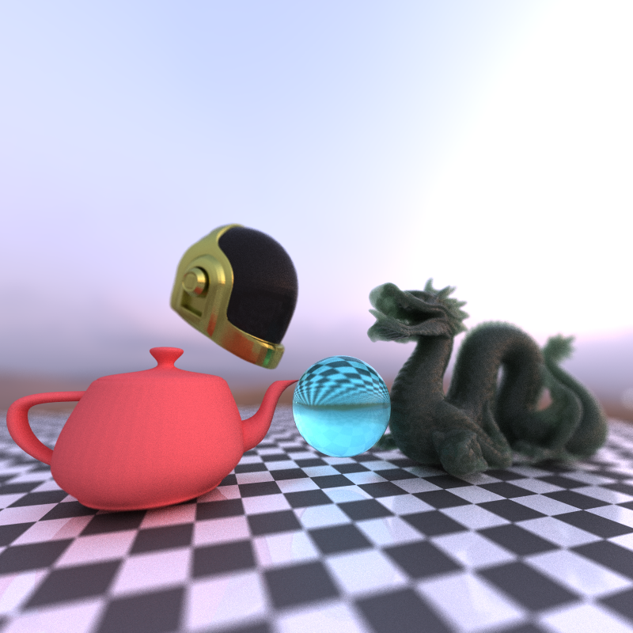
<br>

## Req. Features
### Jittered Anti-Aliasing
Aliasing occurs from an undersampling of a signal, producing a lower frequency result - in this case, we can think of it as a single pixel undersampling the color contents in its resolution space. This can be easily alleviated by randomly jittering/offseting the ray origin position so that it samples different areas of the pixel, and through accumulation, averages all the results together. This allows us to get sharper and more defined edges.

<table>
<tr>
<th>No AA</th>
<th>With AA</th>
</tr>
<tr>
<td>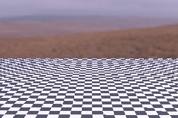</td>
<td>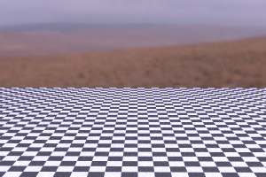</td>
</tr>
</table>


<br>

## Pathtracer BRDF+BTDF Model
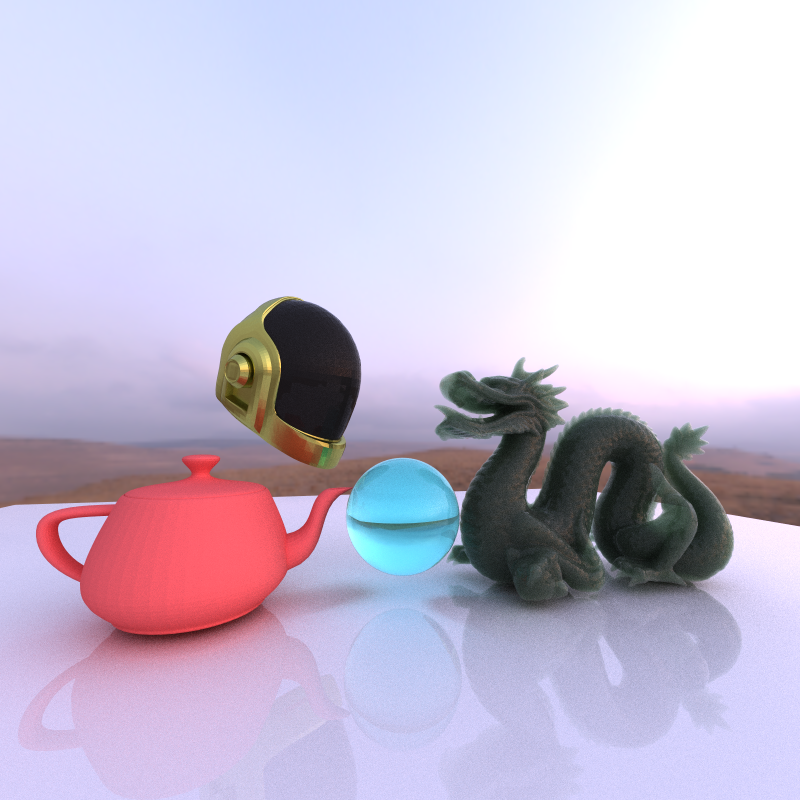
<br>
*Scene featuring various BSDFs. Included are metals, a shiny smooth floor, diffuse materials, transmissive glass, and a subsurface scattered dragon*

One of my goals for the project was to create a universal BSDF model that combines BRDF + BTDF into one artist-friendly/parameterized material contianing options for: *roughness, metallic, transmissive, and subsurface*. 

Unfortunately I didn't get enough time to combine this all together, but the inspiration came from [Disney's 2015 BSDF model](https://blog.selfshadow.com/publications/s2015-shading-course/burley/s2015_pbs_disney_bsdf_slides.pdf) that mixed certain elements together. I'll definitely do this later, but for now, I've separated the BRDF/BTDFs into their own materials defined by the scene JSON.

---
### Lambert Diffuse BRDF + Microfacet Specular GGX
For my BRDF, I use the Cook-Torrance model to simulate diffuse and specular surfaces. I use a uniform random number ```p``` from 0-1 to sample between the two surfaces, where if ```p < fresnel```, we sample specular, else diffuse. This overall represents ```f_r = (1.0f - f) * k_d + f * k_s```, though split into two bounces.

Dielectric materials use the dielectric fresnel (using 1.45 surface IOR, this should approximate to ~0.04), whereas metallic conductors simply use a fresnel Schlick approximation, allowing most samples to be specular. 

Diffuse sampling uses the uniform cosine-weighted hemisphere sampling for wi. Upon dividing out BRDF/pdf, the diffuse weight evaluates to just material albedo.

For specular BRDF, I use the GGX microfacet model, also using the [GGX NDF, Walter '07](https://www.graphics.cornell.edu/~bjw/microfacetbsdf.pdf) - this controls the distribution of normals such that rougher surfaces are more spread out compared to smoother reflective lobes.

Referencing Joe Schutte's article on [sampling with GGX](https://schuttejoe.github.io/post/ggximportancesamplingpart1/) and Walter's paper on weighting samples themselves, we can observe that the returned reflectance can be simplified to F * G, divided by pdf of outgoing rays correctly being in the hemisphere. This becomes much further reduced.

<table>
<tr>
<th></th>
<th>0.0 Roughness</th>
<th>0.5 Roughness</th>
<th>1.0 Roughness</th>
</tr>
<tr>
<td>Dielectric</td>
<td>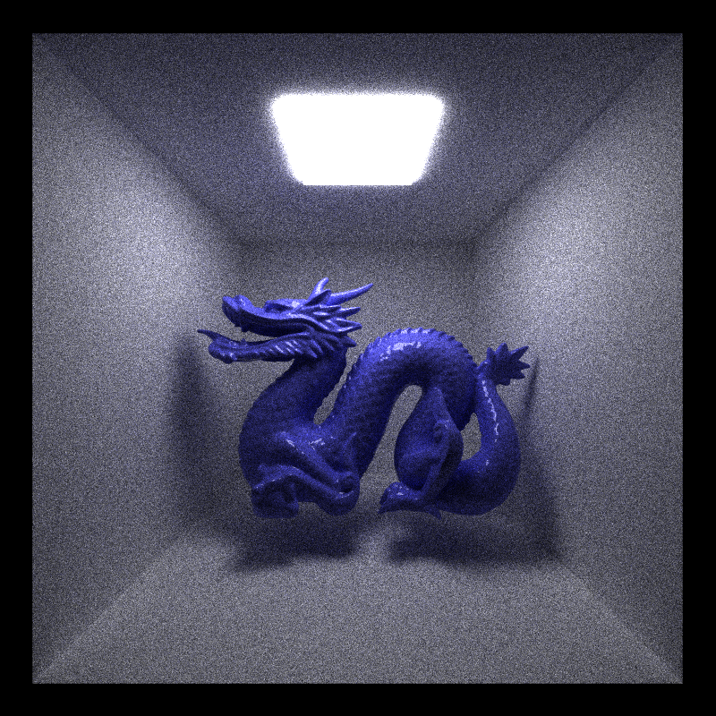</td>
<td>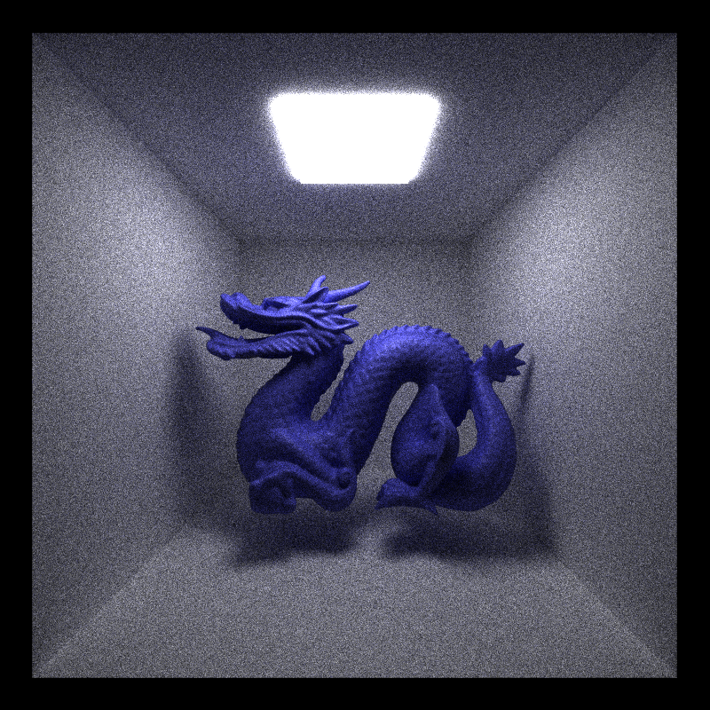</td>
<td>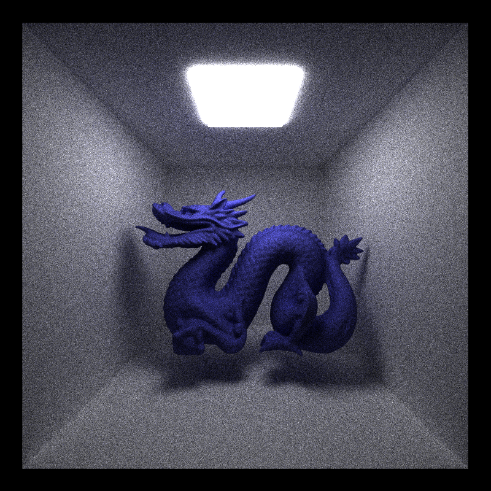</td>
</tr>
<tr>
<td>Metallic</td>
<td>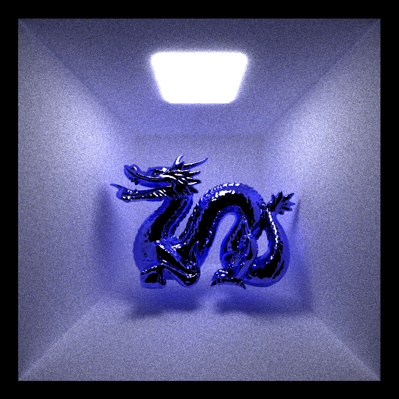</td>
<td>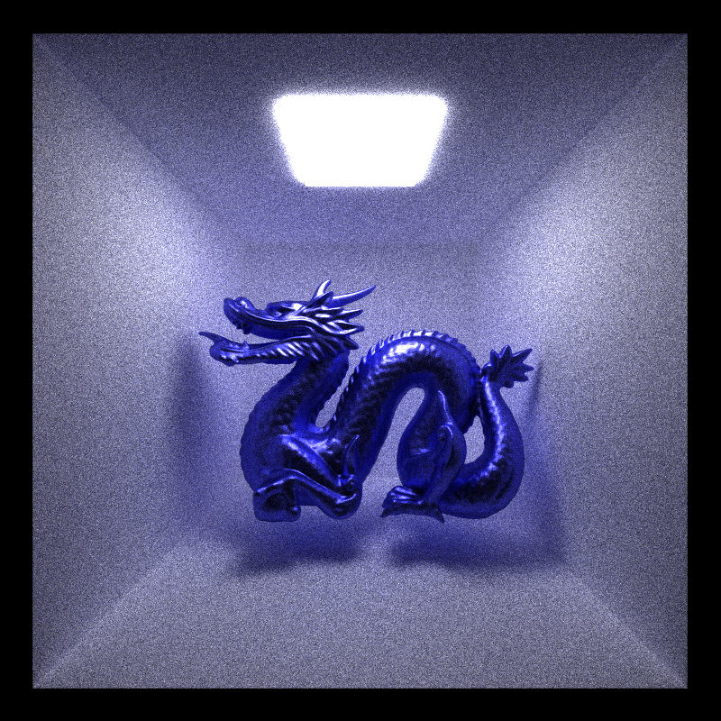</td>
<td>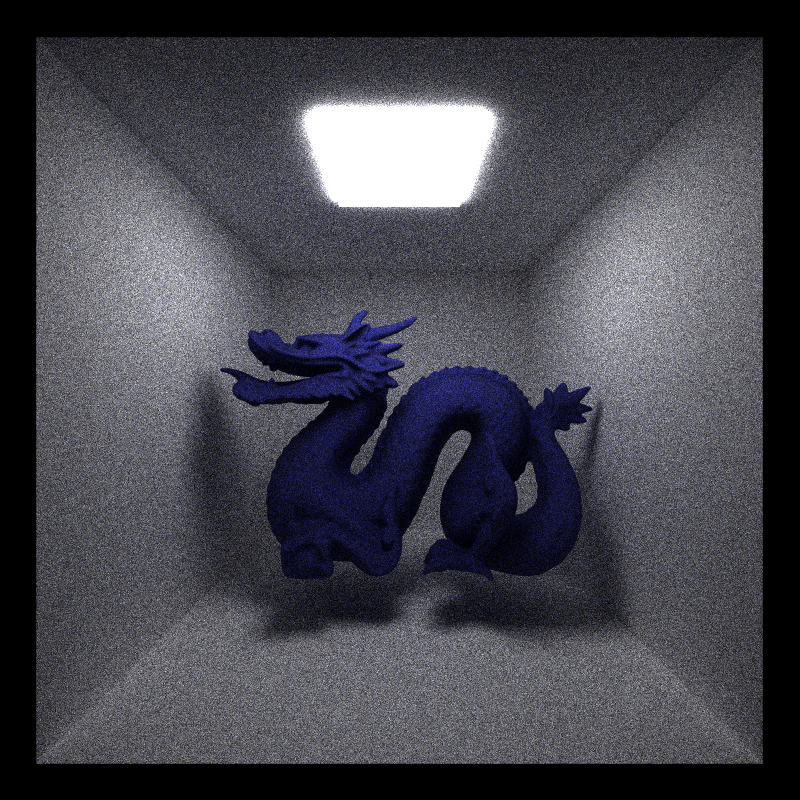</td>
</tr>
</table>

Using the Lambert diffuse, however, has limitations - particularly with self-shadowing that [Heitz's multi-scattering](https://eheitzresearch.wordpress.com/240-2/) BSDF approach aims to solve, instead switching our diffuse model to also adopt a consistent microfacet model that accounts for energy lost from bounces occluded from micro-geometry (if that's a word). It's also worth mentioning [Heitz's VNDF](https://jcgt.org/published/0007/04/01/paper.pdf) as a solution to fireflies caused from GGX's geom term (which I'm currently hacking away by clamping reflectance from 0-1).

More real-time solutions like [Chan's multi-scattering diffuse model](https://advances.realtimerendering.com/s2018/MaterialAdvancesInWWII.pdf) also aim to conserve the energy lost from Lambert, which is based on Heitz's multi-scattering BSDF. Both are perhaps worth implementing in the future!

---

### Extending the BRDF to include transmissive surfaces
Along with the BRDF, the BTDF determines the distribution of light rays transmitted along a surface. For this material in particular, I implemented support for glass, which is treated as a dielectric to determine whether or not a light ray is reflected or refracted by glass.

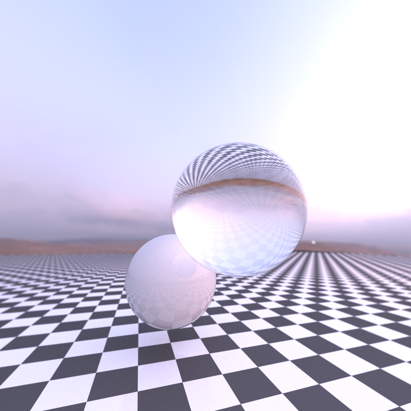
<br>
*Shiny glass ball with a shiny ball behind it.*

The resulting refracted ray is determined by Snell's law, which bends a light ray based on the ratio from two meidum's refractive indices. Entering, for example, considers air and the medium itself.

To account for rough surfaces, I re-use the GGX distribution to determine the micronormal used for reflecting and refracting.

<table>
<tr>
<th>0.0 Roughness</th>
<th>0.5 Roughness</th>
<th>1.0 Roughness</th>
</tr>
<tr>
<td>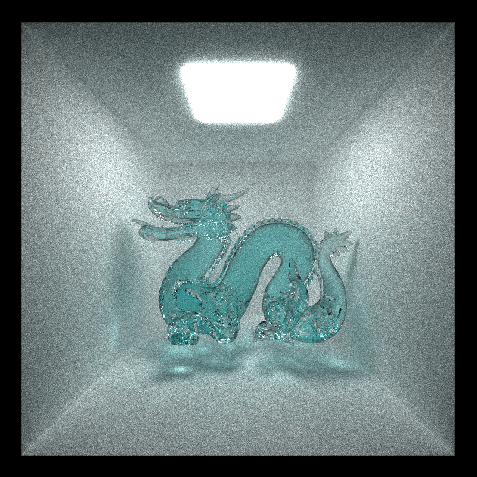</td>
<td>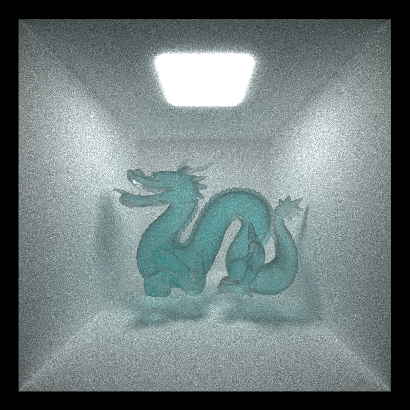</td>
<td>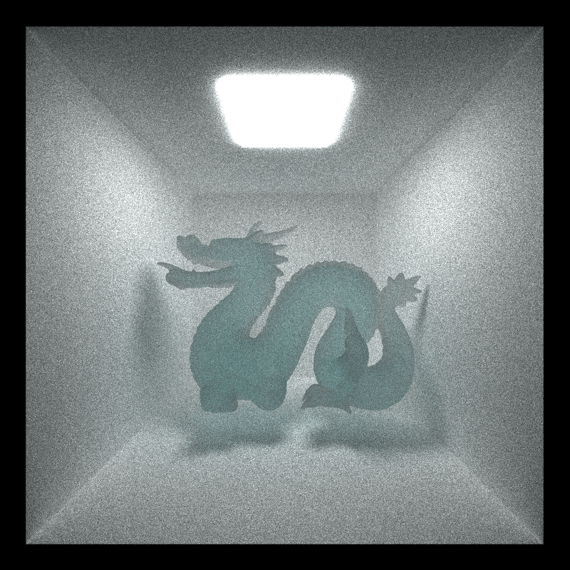</td>
</table>

We can use Beer's law of absorption to tint our glass by the distance traveled within the medium, assuming it's homogeneous.

---

### Subsurface Scattering
Following this [awesome 8 year old blog on subsurface scattering](https://computergraphics.stackexchange.com/questions/5214/a-recent-approach-for-subsurface-scattering), I was able to implement a very brute-force form of path-traced subsurface scattering by keeping track of when a sample enters a speciifc medium, with logic very similar to volumetric scattering (potential future addition?). 

The BSSSRDF assumes the medium is isotropic and homogenous, using Beer's Law to determine transmittance. Absorption and scattering coefficients are hand-tuned, but I plan to use a proper reflectance model to derive them from albedo.

<table>
<tr>
<td>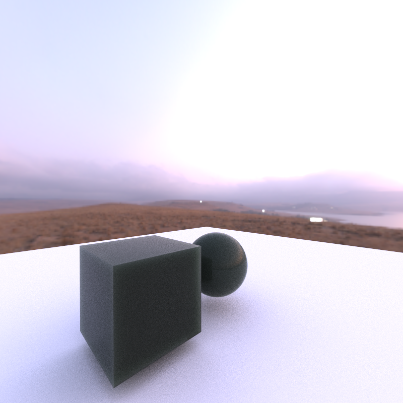</td>
<td>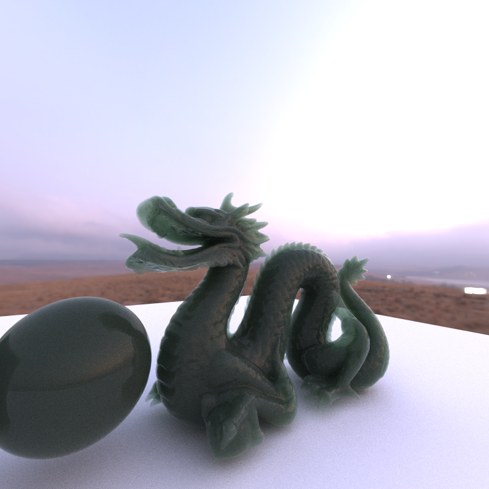</td>
</tr>
<tr>
<td><i>Simple primitives rendered with SSS</i></td>
<td><i>Sphere and dragon rendered with SSS</i></td>
<tr>
</table>

When within an isotropic medium, I determine its traveled distance by ```-log(rng()) / scatteringDistance```, where if less than ray intersection ```t```, I randomly uniformally determine its next direction (isotropic phase function) and continue walking. Otherwise, we exit and enter a vacuum. 

I found that using a Henyey-Greenstein anisotropic back-scattering phase function didn't give me better results compared to isotropic, but the implementation is still in the code.

## Various Goodies
### Depth of Field

<table>
<tr>
<th>No DOF</th>
<th>With DOF</th>
</tr>
<tr>
<td>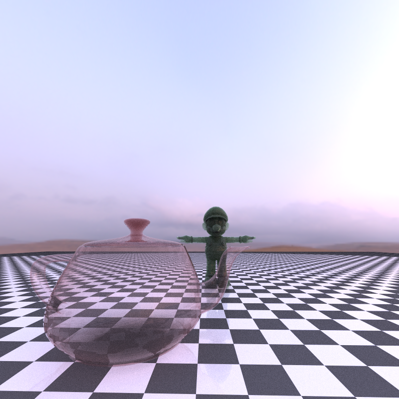</td>
<td>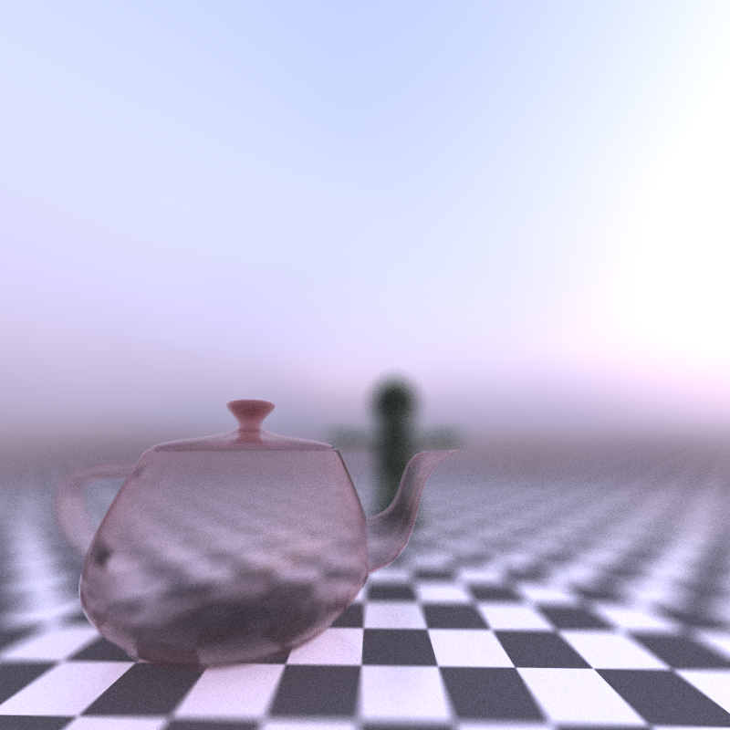</td>
</tr>
</table>

## Mesh Loading/Rendering with GLTF
gltf is an awesome model format. It represents a given scene by a tree hierarchy, starting from the scene to nodes with children that have primitives. Our goal is to convert these primitives into triangles that our pathtracing intersection test can detect.

### Using the tinyGLTF loader
Nowadays, ```.objs``` are no longer the common file form of representing 3D objects. Instead, companies use FBX, USD, or even proprietary formats. More common is also the ```.gltf format```.

GLTF/GLBs are comprised of a scene representation, housing children that eventually have primitives. Our goal is to read primitive indices and position information, stored through accessors that store bufferViews for these respective buffers of information. GLBs have specific formats for representing their data - for instance, a smaller GLTF can use a 16 bit ushort to store indices info if there are less than 65k indices, while something larger like the Stanford dragon may require the full 32 bits. Using a library like tinyGLTF can greatly simplify gltf importing for us by reading these files and providing parsed information in cpp.

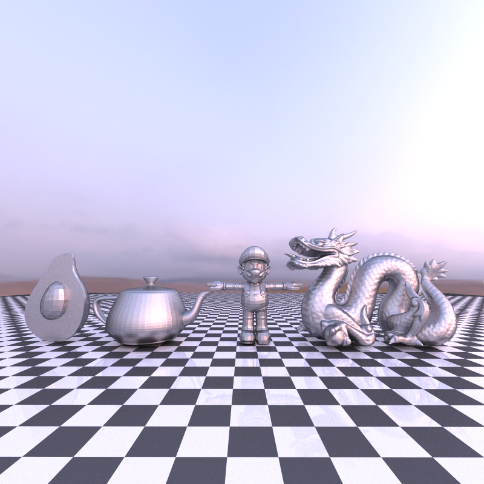
<br>
*The gang. Featuring your favorite avocado, teapot, Wahoo, and dragon. In total, 130,470 triangles rendered!*

### BVH
A bounding volume hierarchy (BVH) is a spatial tree structure used to speed up ray traversals by wrapping our geometry into volumes. Volumes are then recurisvely grouped together until we result in one root volume. When a ray traverses to find an intersection, it starts at the root, checking if it intersects with one of two volumes - if either, it recurses into checking its intersected volume's children, continuing until we end at one triangle.

Following Jacco Bikker's guide to building BVHs, I was able to put together a naive yet surprisingly effective BVH. On the teapot test model from Morgan Mcguire's Casual-Effects website with 15k tris, I was able to see a **24x reduction** from 292.196ms to an amazing 12.774ms.
<table>
<tr>
<th>No BVH: 292.196ms</th>
<th>With BVH: 12.774ms!</th>
</tr>
<tr>
<td></td>
<td></td>
</tr>
</table>

Without BVH, something like the 180k tri Stanford dragon would take well over a minute to render a single iteration! With it, on average, it takes about 14ms to render.


Feedback
- The sphere intersection normal flipping code should be removed.
- stb_image files should be updated, it might make gltf importing easier for those using tinyGLTF, but also it doesn't hurt to use more updated libraries.