CUDA Path Tracer
================

**University of Pennsylvania, CIS 565: GPU Programming and Architecture, Project 3**

* Anthony Ge
  * [LinkedIn](https://www.linkedin.com/in/anthonyge/), [personal website](https://www.geant.pro)
* Tested on: Windows 11, i9-13900H @ 2600 Mhz 16GB, NVIDIA 
GeForce RTX 4070 Laptop GPU 8GB (personal)
<br>
<br>


<table>
<tr>
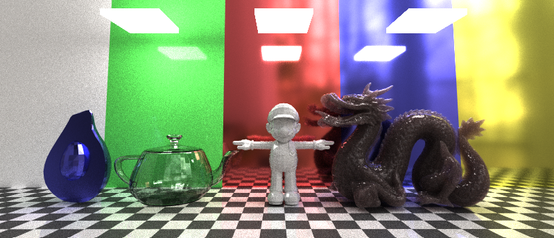
</tr>
<tr>
<td>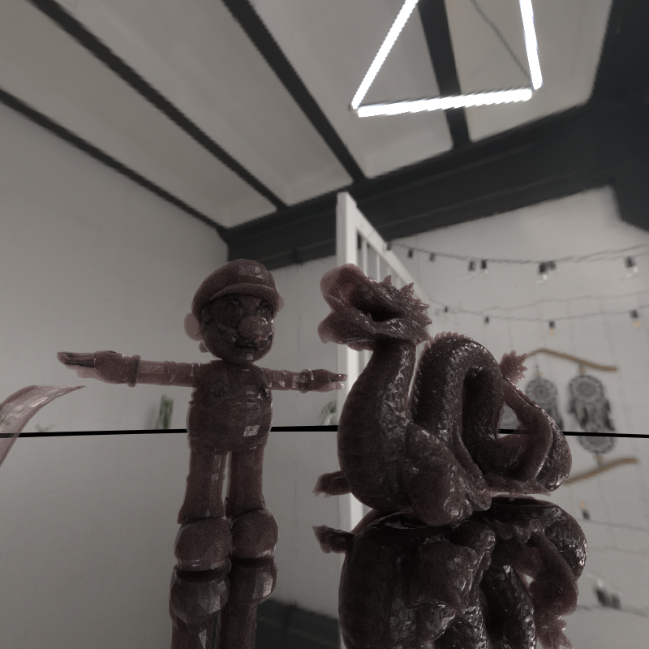</td>
<td>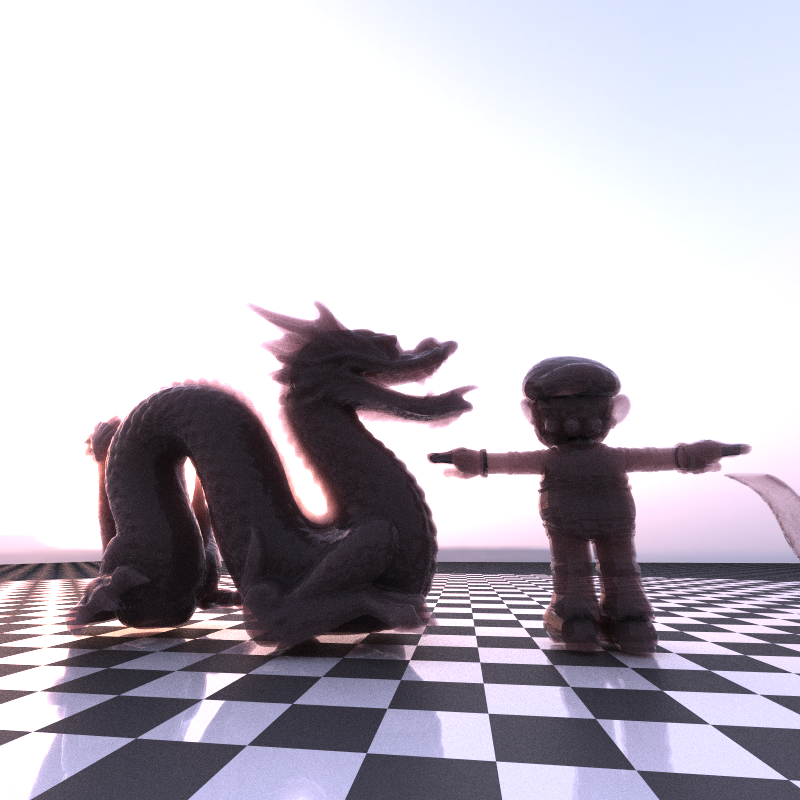</td>
</tr>
</table>

<!-- 

 -->

## What is a path tracer?

## Req. Features
### Jittered Anti-Aliasing
Aliasing occurs from an undersampling of a signal, producing a lower frequency result - in this case, we can think of it as a single pixel undersampling the color contents in its resolution space. This can be easily alleviated by randomly jittering/offseting the ray origin position so that it samples different areas of the pixel, and through accumulation, averages all the results together. This allows us to get sharper and more defined edges.

<table>
<tr>
<th>No AA</th>
<th>With AA</th>
</tr>
<tr>
<td></td>
<td></td>
</tr>
</table>

### Diffuse BRDF
This is later explained in the Pathtracer BRDF+BTDF model section, but it's definitely implemented.

### Stream Compaction + Material Sort
This is also later explained and implemented in the optimization section.

<br>

## Pathtracer BRDF+BTDF Model

<br>
*Scene featuring various BSDFs. Included are metals, a shiny smooth floor, diffuse materials, transmissive glass, and a subsurface scattered dragon*

One of my goals for the project was to create a universal BSDF model that combines BRDF + BTDF into one artist-friendly/parameterized material contianing options for: *roughness, metallic, transmissive, and subsurface*. 

Unfortunately I didn't get enough time to combine this all together, but the inspiration came from [Disney's 2015 BSDF model](https://blog.selfshadow.com/publications/s2015-shading-course/burley/s2015_pbs_disney_bsdf_slides.pdf) that mixed certain elements together. I'll definitely do this later, but for now, I've separated the BRDF/BTDFs into their own materials defined by the scene JSON.

---
### Lambert Diffuse BRDF + Microfacet Specular GGX
For my BRDF, I use the Cook-Torrance model to simulate diffuse and specular surfaces. I use a uniform random number ```p``` from 0-1 to sample between the two surfaces, where if ```p < fresnel```, we sample specular, else diffuse. This overall represents ```f_r = (1.0f - f) * k_d + f * k_s```, though split into two bounces.

Dielectric materials use the dielectric fresnel (using 1.45 surface IOR, this should approximate to ~0.04), whereas metallic conductors simply use a fresnel Schlick approximation, allowing most samples to be specular. 

Diffuse sampling uses the uniform cosine-weighted hemisphere sampling for wi. Upon dividing out BRDF/pdf, the diffuse weight evaluates to just material albedo.

For specular BRDF, I use the GGX microfacet model, also using the [GGX NDF, Walter '07](https://www.graphics.cornell.edu/~bjw/microfacetbsdf.pdf) - this controls the distribution of normals such that rougher surfaces are more spread out compared to smoother reflective lobes.

Referencing Joe Schutte's article on [sampling with GGX](https://schuttejoe.github.io/post/ggximportancesamplingpart1/) and Walter's paper on weighting samples themselves, we can observe that the returned reflectance can be simplified to F * G, divided by pdf of outgoing rays correctly being in the hemisphere. This becomes much further reduced.

<table>
<tr>
<th></th>
<th>0.0 Roughness</th>
<th>0.5 Roughness</th>
<th>1.0 Roughness</th>
</tr>
<tr>
<td>Dielectric</td>
<td></td>
<td></td>
<td></td>
</tr>
<tr>
<td>Metallic</td>
<td></td>
<td></td>
<td></td>
</tr>
</table>

Using the Lambert diffuse, however, has limitations - particularly with self-shadowing that [Heitz's multi-scattering](https://eheitzresearch.wordpress.com/240-2/) BSDF approach aims to solve, instead switching our diffuse model to also adopt a consistent microfacet model that accounts for energy lost from bounces occluded from micro-geometry (if that's a word). It's also worth mentioning [Heitz's VNDF](https://jcgt.org/published/0007/04/01/paper.pdf) as a solution to fireflies caused from GGX's geom term (which I'm currently hacking away by clamping reflectance from 0-1).

More real-time solutions like [Chan's multi-scattering diffuse model](https://advances.realtimerendering.com/s2018/MaterialAdvancesInWWII.pdf) also aim to conserve the energy lost from Lambert, which is based on Heitz's multi-scattering BSDF. Both are perhaps worth implementing in the future!

---

### Extending the BRDF to include transmissive surfaces
Along with the BRDF, the BTDF determines the distribution of light rays transmitted along a surface. For this material in particular, I implemented support for glass, which is treated as a dielectric to determine whether or not a light ray is reflected or refracted by glass.

<p style="text-align: center;">

<br>
<i>Shiny glass with a shiny ball behind it.</i>
<p>

The resulting refracted ray is determined by Snell's law, which bends a light ray based on the ratio from two meidum's refractive indices. Entering, for example, considers air and the medium itself.

To account for rough surfaces, I re-use the GGX distribution to determine the micronormal used for reflecting and refracting.

<table>
<tr>
<th>0.0 Roughness</th>
<th>0.5 Roughness</th>
<th>1.0 Roughness</th>
</tr>
<tr>
<td></td>
<td></td>
<td></td>
</table>

We can use Beer's law of absorption to tint our glass by the distance traveled within the medium, assuming it's homogeneous.

---

### Subsurface Scattering
Subsurface scattering describes the phenomenom of entered light scattering within a medium before leaving an exit point. This explains the reddish glow of skin and the waxy color of something like jade. It's an astonishingly beautiful visual property.

<p style="text-align: center;">
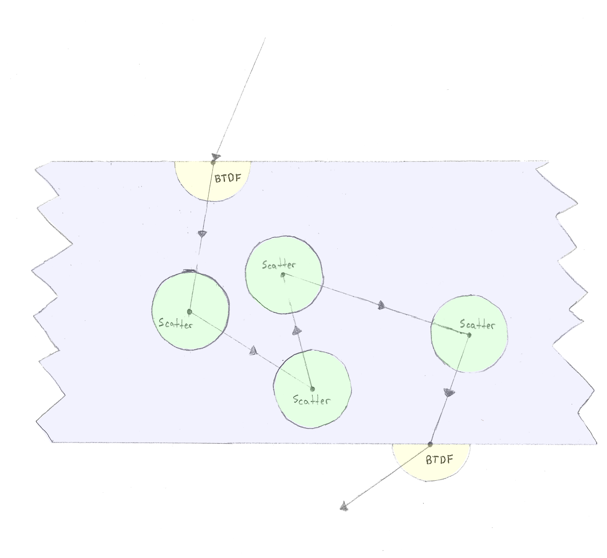
<br>
<i>Subsurface scattering visualization not from me. Taken from <a href="https://computergraphics.stackexchange.com/questions/5214/a-recent-approach-for-subsurface-scattering">Adrian Astley</a> </i>
<p>

Following this [awesome 8 year old blog on subsurface scattering](https://computergraphics.stackexchange.com/questions/5214/a-recent-approach-for-subsurface-scattering), I was able to implement a very brute-force form of path-traced subsurface scattering by keeping track of when a sample enters a speciifc medium, with logic very similar to volumetric scattering (potential future addition?). 

The BSSSRDF assumes the medium is isotropic and homogenous, using Beer's Law to determine transmittance. Absorption and scattering coefficients are hand-tuned, but I plan to use a proper reflectance model to derive them from albedo.

<table>
<tr>
<td></td>
<td></td>
</tr>
<tr>
<td><i>Simple primitives rendered with SSS</i></td>
<td><i>Sphere and dragon rendered with SSS</i></td>
<tr>
</table>

When within an isotropic medium, I determine its traveled distance by ```-log(rng()) / scatteringDistance```, where if less than ray intersection ```t```, I randomly uniformally determine its next direction (isotropic phase function) and continue walking. Otherwise, we exit and enter a vacuum. 

I found that using a Henyey-Greenstein anisotropic back-scattering phase function didn't give me better results compared to isotropic, but the implementation is still in the code.


## Various Goodies
### Depth of Field

Depth of field is described as the range of distances that appears sharp. We can simulate this in a pathtracer by switching from a pinhole camera to a lens-based one. Instead of shooting rays from the same point in world space, we can use a disk instead such that the area of focus converges at a user defined focal point from our camera. Thus, objects at the focal point appear sharp while others beyond blur out.

<table>
<tr>
<th>No DOF</th>
<th>With DOF</th>
</tr>
<tr>
<td></td>
<td></td>
</tr>
</table>

### Environment Mapping
Commonly in pathtracers, rays that miss geometry and instead leave with a distance of INF are terminated and contribute no radiance. If we instead add a sky for missed rays to hit through use of environment mapping, all missed rays can contribute radiance.

<table>
<tr>
<th>Studio Environment Map</th>
<th>Dusk Environment Map</th>
</tr>
<tr>
<td></td>
<td>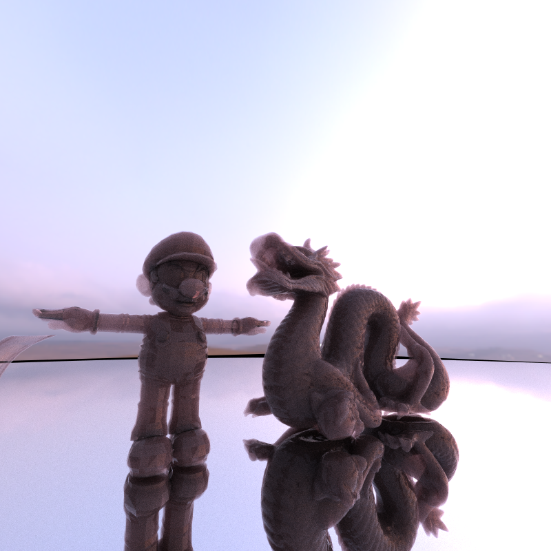</td>
</tr>
</table>

For my environments, I use HDRs downloaded from [Polyhaven](https://polyhaven.com/hdris). I implemented tonemapping with the ACEs section to help remap color ranges to fit properly onto displays, but unfortunately this was done after the project deadline. I will write about it later though since it's its own topic that I'm still studying!

## Mesh Loading/Rendering with GLTF
gltf is an awesome model format. It represents a given scene by a tree hierarchy, starting from the scene to nodes with children that have primitives. Our goal is to convert these primitives into triangles that our pathtracing intersection test can detect.

### Using the tinyGLTF loader
Nowadays, ```.objs``` are no longer the common file form of representing 3D objects. Instead, companies use FBX, USD, or even proprietary formats. More common is also the ```.gltf format```.

GLTF/GLBs are comprised of a scene representation, housing children that eventually have primitives. Our goal is to read primitive indices and position information, stored through accessors that store bufferViews for these respective buffers of information. GLBs have specific formats for representing their data - for instance, a smaller GLTF can use a 16 bit ushort to store indices info if there are less than 65k indices, while something larger like the Stanford dragon may require the full 32 bits. Using a library like tinyGLTF can greatly simplify gltf importing for us by reading these files and providing parsed information in cpp.


<br>
*The gang. Featuring your favorite avocado, teapot, Wahoo, and dragon. In total, 130,470 triangles rendered!*

<br>

# Optimizations
## Improving Wave Divergence/Compute
To test for performance, I evaluated and compared ms frame time against different scenes in two scenes: Cornell box, which is mostly closed and uses a single light sounrce, and a more complex scene that's open faced, which I'll call open scene. 

<table>
<tr>
<th>Cornell Scene (8 Prims)</th>
<th>Open Scene (130k Tris)</th>
</tr>
<tr>
<td>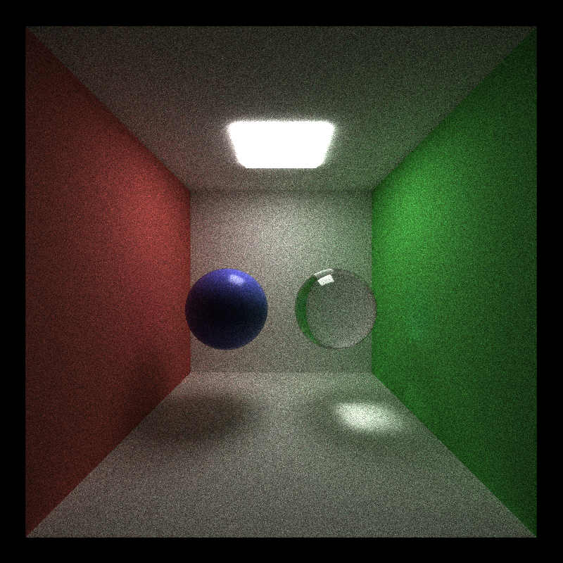</td>
<td>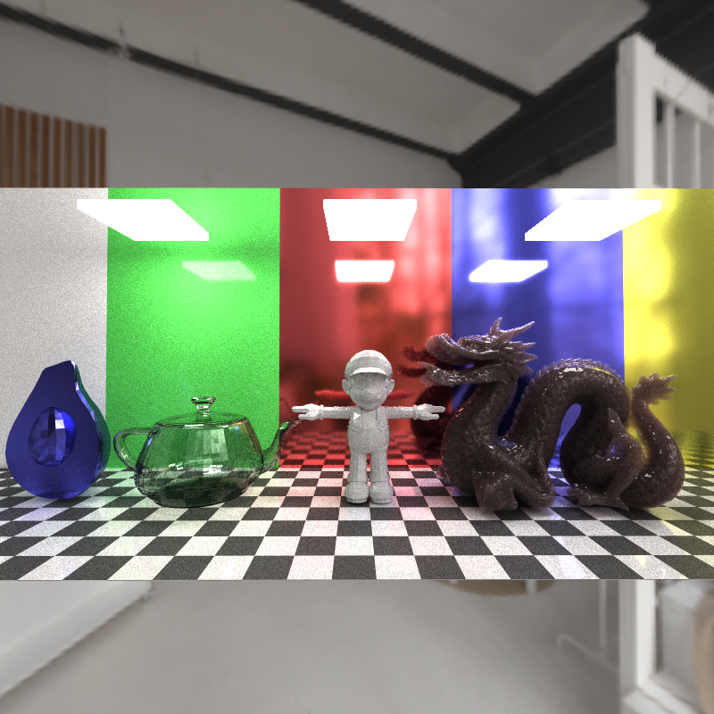</td>
</tr>
</table>

The overall findings are as follows:
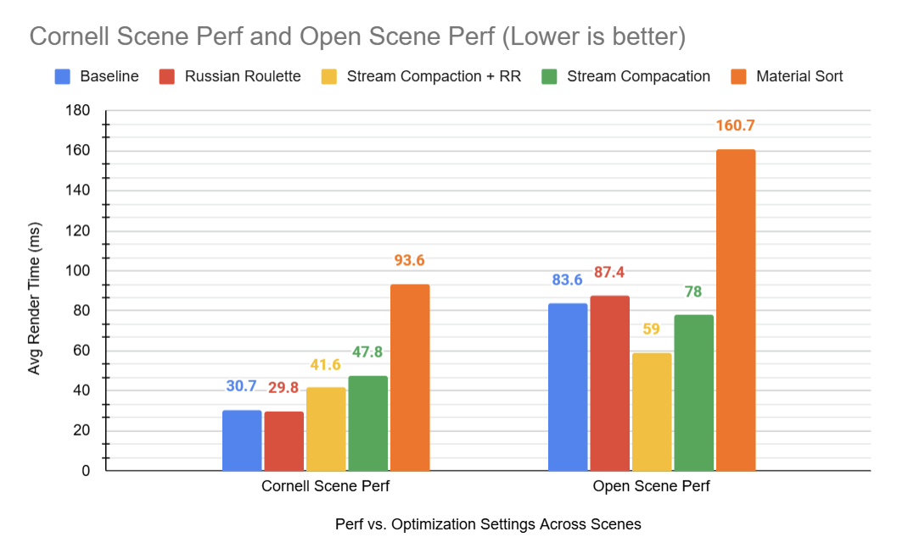

Average render time is measured from within the program, logged after 500 iterations. **We ideally want to reduce the render time as much as possible** so more can be rendered within a single second (denoting FPS).


---
### Stream Compaction
Stream compaction is responsible for re-ordering active paths such that they are contiguous together. This way, it's more likely that a wave will contain either fully active or inactive paths. This improves wave occupancy and throughput by reducing divergence among all the threads.

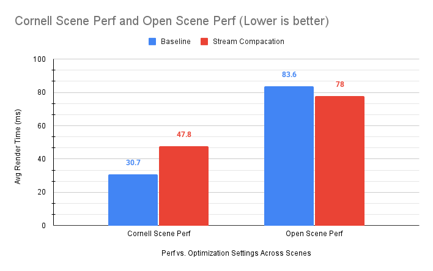


I observed for scenes like the **Cornell,** where it's less likely for paths to terminate quickly due to the closed box geometry and single light source, **stream compaction performed worse, resulting ~17.1ms INCREASE** (observing 32.6 to 20.8 FPS with stream compaction on). 

In this case, the overhead from running compaction (I use thrust::partition after the shading) overwhelms the hoped speedups from better wave occupancy - however, if most threads are active anyways and will require the max bounces to terminate, there's little divergence to begin with and it's likely that there's decent occupancy to begin with.

With the **open scene,** however, the results are much more dramatic, observing a **83.6 to 78ms improvement, a 5.6ms drop or 7% improvement.** Unlike the Cornell scene, having an open sky does allow most paths to terminate rather quickly, allowing the speedups from compaction to drastically improve wave occupancy.

---
### Russian Roulette
[Russian Roulette termination](https://pbr-book.org/3ed-2018/Monte_Carlo_Integration/Russian_Roulette_and_Splitting) is a simple optimization that randomly terminates paths that contribute little weight to the final thorughput. This is based on a uniformly determined probability number, which if above a threshold based on the max path color channel, will terminate the ray - otherwise, rays are weighted appropriately based on its survival.

The lower the threshold is, the more like ```p > threshold```, resulting in termination. This use of early termination can be particularly helpful for stream compaction since this will cause more divergence.

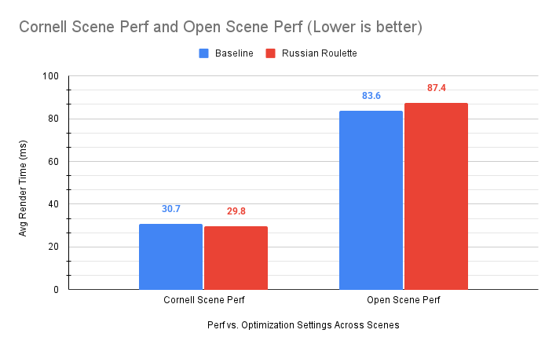
With Russian Roulette, **I observed a slight ~0.9ms reduction improvement in the Cornell scene, but an unfortunate 3.8ms increase in the open scene.** For the Cornell, it's more likely that rays are unlikely to reach the light source at the top, so the further the bounces occur, the higher the termination threshold becomes, resulting in better rays terminated. I think the opposite happens for the open scene. 

### Compounded Stream Compaction + Russian Roulette
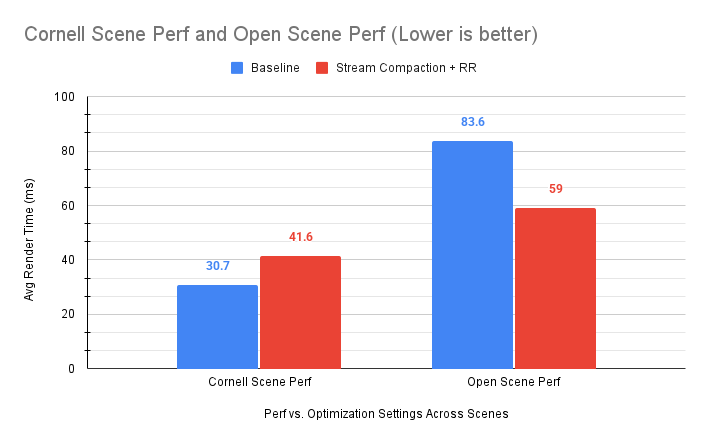

I was able to observe some significant performance changes by combining both optimizations together. **For the Cornell scene, I observed a terrible 10.9ms increase, though it IS a 6.2ms improvement from just stream compaction itself.** This means that the use of Russian Roulette definitely terminated paths earlier, and with stream compaction, resulted in better wave occupancy and coherency. However, the improvements are still not enough to overpower the overhead from running stream compaction.

**For the open scene, the performance improved remarkably, observing an incredible 24.6ms drop!** Though, it may be better to compare this improvement with different materials (in this case, my open scene has subsurface scattering and glass elements, which can make it much more likely for rays to contribute nothing, letting Russian Roulette terminate faster). Nonetheless, the improvements is a bit confusing, I assume that with Russian Roulette terminating rays earlier, it boosts the impacts of stream compaction's improved wave coherency, resulting in overall better performance.

---
### Material Sorting
Material sort aims to re-order paths by material ID, making more likely that paths grouped by material will be evaluated by the same wave, reducing divergence and improving performance.


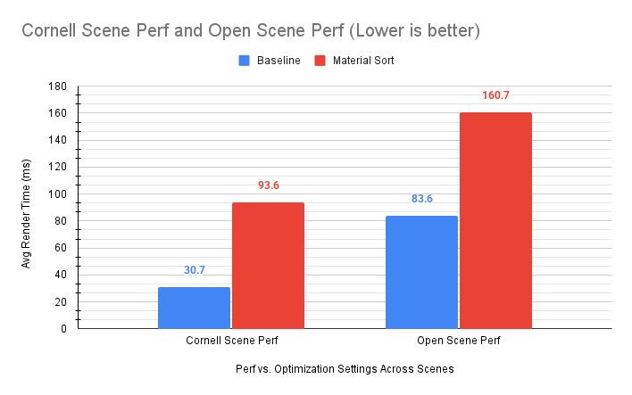
Unfortunately, for both Cornell and Open, material sorting causes worse performance, observing a 62.9ms and 77.1ms increase respectively. Given that there are far more complex materials in Open Scene (Cornell has mostly diffuse with the exception of a microfacet + transmissive, so 3 in total), featuring 10 unique material IDs, there is still a relative improvement from 1.9x worse perf compared to 3.04x in Cornell. 


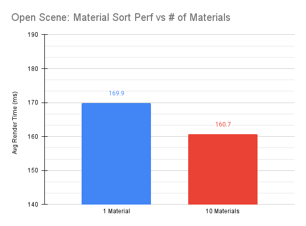
To fully assess its impact scaled against more materials used, I benchmarked against the Open scene with just one material instead, witnessing a 9.2ms improvement by using more materials with sorting enabled. 

**So overall, the material sort *does* perform better for scenes with more materials, but the overhead from sorting is significantly greater than the reductions achieved from lowering divergence.**

---
## Improving Ray Traversal with Bounding Volume Hierarchies (BVH)
Earlier, I mentioned GLB/mesh loading as an important feature to get complex shapes into the path tracer. However, this causes our naive geometry lookup for a ray to explode massively in poor performance. 

Considering a mesh with 100k tris, our ray would have to scan through 100k tris. I didn't even bother measuring the performance from that because it's just plainly unacceptable. This is overall a ```O(n)``` performance hit, which scales terribly, but fortunately spatial data structures exist to solve these kinds of problems.

<p style="text-align: center;">
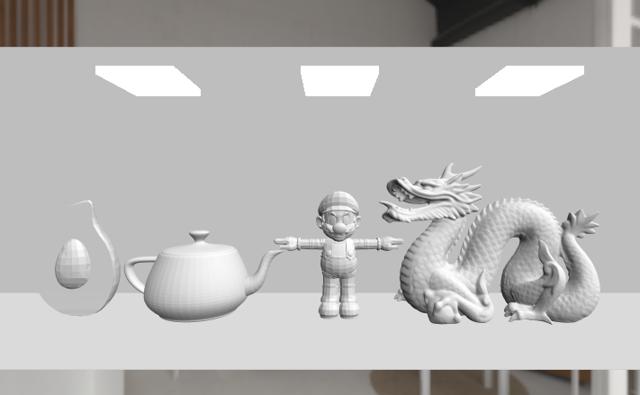
<br>
<i>This scene has 130k tris! Can you imagine checking 130k tris per thread??? Naively running that would crash the program.</i>
<p>

**A bounding volume hierarchy (BVH) is a spatial tree structure used to speed up ray traversals by wrapping our geometry into volumes.** Volumes are then recurisvely grouped together until we result in one root volume. When a ray traverses to find an intersection, it starts at the root, checking if it intersects with one of two volumes - if either, it recurses into checking its intersected volume's children, continuing until we end at one triangle.

<p style="text-align: center;">
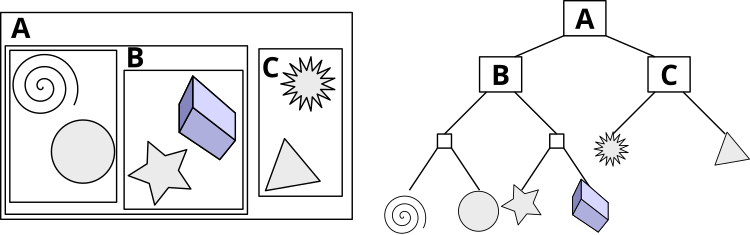
<br>
<i>BVH tree visualization from <a href="https://en.wikipedia.org/wiki/Bounding_volume_hierarchy">Wikipedia</a> </i>
<p>

[Following Jacco Bikker's guide to building BVHs,](https://jacco.ompf2.com/2022/04/13/how-to-build-a-bvh-part-1-basics/) I was able to put together a naive yet surprisingly effective BVH. On the teapot test model from Morgan Mcguire's Casual-Effects website with 15k tris, I was able to see a **24x reduction from 292.196ms to an amazing 12.774ms.**

<table>
<tr>
<th style="text-align: center;">No BVH</th>
<th style="text-align: center;">With BVH</th>
</tr>
<tr>
<td></td>
<td></td>
</tr>
<tr>
<td style="text-align: center;" >292.196ms</td>
<td style="text-align: center;" >12.774ms</td>
</tr>
</table>

**Without BVH, something like the 180k tri Stanford dragon would take well over a minute to render a single iteration! With BVH, on average, it takes about 14ms to render.**

## Conclusion
Overall, this was a pretty fun project letting me really refine my understanding of BRDFs and path tracing. It was a lot of fun trying out subsurface scattering for the first time and building a complex BSDF. I hope to spend more time in the future to implement more features to get some even nicer renders.

There were a lot of frustrating moments caused by the base code that I assumed just worked (rendering the tramissive sphere was overly annoying because of a normal flip within the glass. Though, I suppose, the intent might've been for us to detect whether or not we're in a medium. I don't know, it didn't follow well with PBRT's assumption at all.).


### References
- https://www.graphics.cornell.edu/~bjw/microfacetbsdf.pdf (GGX paper by Walter, et al.)
- https://computergraphics.stackexchange.com/questions/5214/a-recent-approach-for-subsurface-scattering (Adrian Astley's fantastic post about isotropic subsurface scattering.)
- https://schuttejoe.github.io/post/ggximportancesamplingpart1/ (Microfacet GGX implementation blog with pdf simplification.)
- https://media.gdcvault.com/gdc2017/Presentations/Hammon_Earl_PBR_Diffuse_Lighting.pdf (Titanfall 2 presentation on different GGX geom models)
- https://graphicrants.blogspot.com/2013/08/specular-brdf-reference.html#:~:text=Geometric%20Shadowing,%E2%8B%85vn%E2%8B%85v. (Brian Karis blog on a bunch of different BRDF models.)
- https://pharr.org/matt/blog/2022/05/06/trowbridge-reitz (GGX might just be the same as Trowbridge-Reitz.)
- https://pbr-book.org/3ed-2018/Monte_Carlo_Integration/Russian_Roulette_and_Splitting (Russian Roulette)
- https://knarkowicz.wordpress.com/2016/01/06/aces-filmic-tone-mapping-curve/


### Bloopers