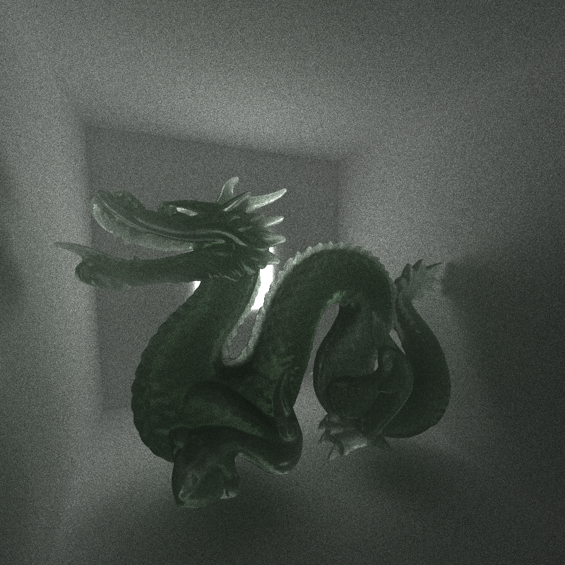

CUDA Path Tracer
================

**University of Pennsylvania, CIS 565: GPU Programming and Architecture, Project 3**

* (TODO) YOUR NAME HERE
* Tested on: (TODO) Windows 22, i7-2222 @ 2.22GHz 22GB, GTX 222 222MB (Moore 2222 Lab)

### (TODO: Your README)

*DO NOT* leave the README to the last minute! It is a crucial part of the
project, and we will not be able to grade you without a good README.



<br>

*Cool dragon picture for now. 871k tris with a fun in the works subsurf model.*

## Ge Pathtracer BRDF Model
### Diffuse BRDF + Microfacet Specular GGX

For my BRDF, I use the Cook-Torrance model to simulate diffuse and specular surfaces. I use a uniform random number from 0-1 to sample between the two surfaces, where if probability is less than average F0, I sample diffuse, otherwise I sample specular. This allows dielectrics to sample more diffuse, whereas conductors absorb and require fully specular reflections.

Diffuse sampling uses the uniform cosine-weighted hemisphere sampling for wi, while I use the GGX NDF to sample the specular direction such that roughness now affects the lobe of samples. Upon dividing out BRDF/pdf, the diffuse weight evaluates to just material albedo.

For specular BRDF, I use the GGX microfacet model. Referencing Joe Schutte's article on [sampling with GGX](https://schuttejoe.github.io/post/ggximportancesamplingpart1/) and Walter's paper on weighting samples themselves, we can observe that the returned reflectance can be simplified to F * G, divided by pdf of outgoing rays correctly being in the hemisphere. This becomes much further reduced.

(TO DO: insert most up to date details regarding my implementation thus far.)

<table>
<tr>
<td></td>
<td></td>
<td></td>
</tr>
<td></td>
<td></td>
<td></td>
<tr>
</tr>
</table>

### Extending the BRDF to include transmissive surfaces
I haven't done this yet, but I plan to extend my BRDF model to also include BTDF, creating an ultimate BSDF model! I aim to also reference Joe Schutte's implement of the Disney BSDF to achieve this.

So while I haven't done this yet, I DID implement BTDF, being able to render a glass ball if it's strictly chosen as such. For a given transmissive surface, I choose to either refract or reflect based on a 50/50 probability.

The refraction allows us to enter the transmissive surface and bend the incoming ray direction by Snell's law, meaning that for a given material we need to classify its entering and exiting IORs. The reflection, on the other hand, is a simple reflect of the incoming ray by the normal. By weighting the power of each refracted and reflected ray by its fresnel Schlick approximation, we are able to have reflections off grazing angles, while most of the ball becomes transmissive.

Using a transmissive term, I believe it's possible to easily include this into the existing BRDF model, simply using another probability weight to choose whether or not for a given materia we use BRDF or BTDF. More on this later if I get to it, but will instead work on gltf loading instead.

<table>
<tr>
<td></td>
<td></td>
<td></td>
</table>

### BRDF to BSSSRDF? Naive Subsurface Scattering
Following this [awesome 8 year old blog on subsurface scattering](https://computergraphics.stackexchange.com/questions/5214/a-recent-approach-for-subsurface-scattering), I was able to implement a very naive form of path-traced subsurface scattering by keeping track of when a sample enters a speciifc medium. In this case, if our material has subsurface scattering properties, we say that within has an isotropic medium that will handle sampling BRDF evaluation depending on its distance traveled within its random walk.


<br>

The results fairly match the example images in the blog, but I'm not satisfied by how dark it is due to absorbed energy I assume, and also the inefficiencies that come with brute-forcing the subsurface scattering. I hope to reconvert this model to instead use Christensen and Burley's 2016 SSS diffusion profile that relies geometry sampling instead, allowing just a single bounce and easier integration into my diffuse BRDF model.


## Various Goodies
### Depth of Field
TO DO: put in stuff

### Bokeh(?)

## Mesh Rendering with GLTF
gltf is an awesome model format. It represents a given scene by a tree hierarchy, starting from the scene to nodes with children that have primitives. Our goal is to convert these primitives into triangles that our pathtracing intersection test can detect.

### Using the tinyGLTF loader
Nowadays, ```.objs``` are no longer the common file form of representing 3D objects. Instead, companies use FBX, USD, or even proprietary formats. More common is also the ```.gltf format```.

GLTF/GLBs are comprised of a scene representation, housing children that eventually have primitives. Our goal is to read primitive indices and position information, stored through accessors that store bufferViews for these respective buffers of information. GLBs have specific formats for representing their data - for instance, a smaller GLTF can use a 16 bit ushort to store indices info if there are less than 65k indices, while something larger like the Stanford dragon may require the full 32 bits. Using a library like tinyGLTF can greatly simplify gltf importing for us by reading these files and providing parsed information in cpp.

If I get there, I'll write about acquiring normal and texture info, and then sampling it. Haven't gotten there yet.


### BVH
Followed Jacco Bikker's guide to building BVHs. On the teapot test model from Morgan Mcguire's Casual-Effects website with 15k tris, I was able to see a **24x milisecond reduction** from 292.196 to an amazing 12.774.
<table>
<tr>
<th>No BVH: 292.196ms</th>
<th>With BVH: 12.774ms!!!</th>
</tr>
<tr>
<td></td>
<td></td>
</tr>
</table>

Feedback
- The sphere intersection normal flipping code should be removed.
- stb_image files should be updated, it might make gltf importing easier for those using tinyGLTF, but also it doesn't hurt to use more updated libraries.